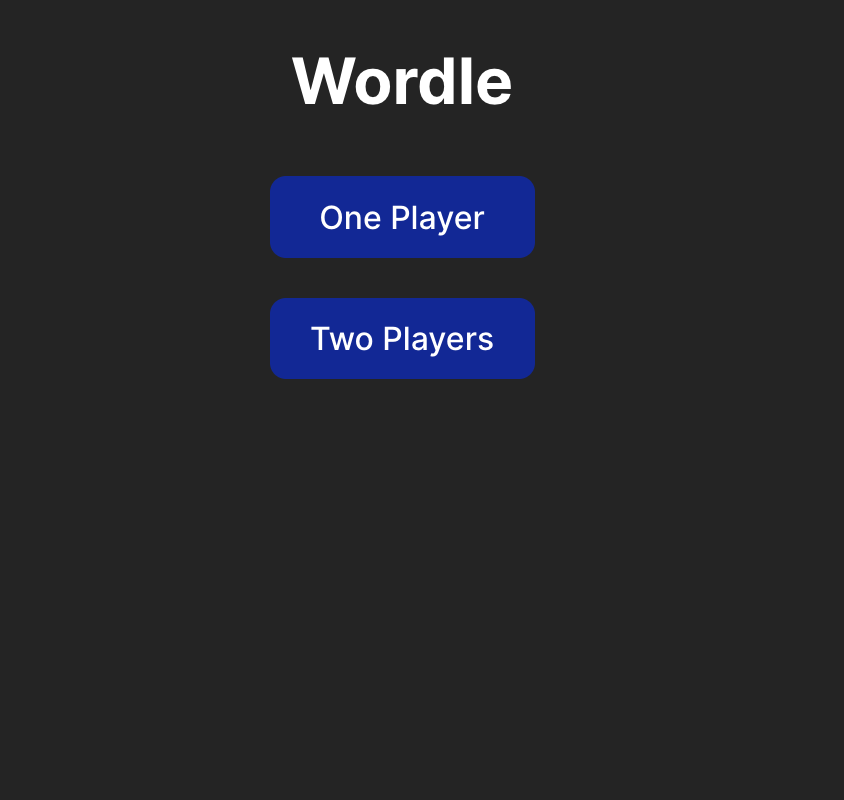
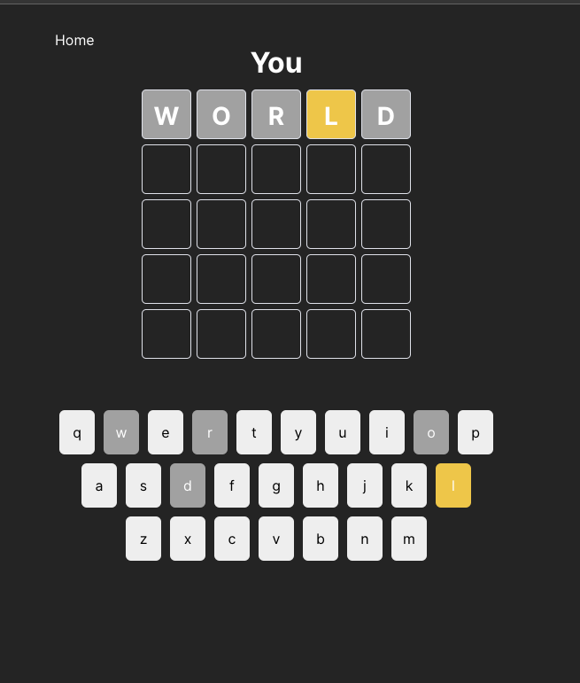
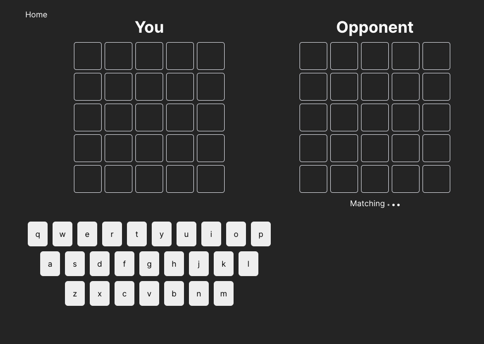
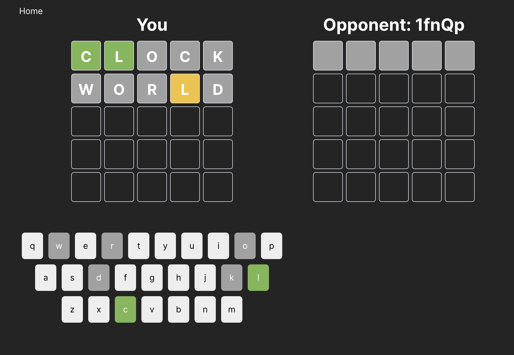
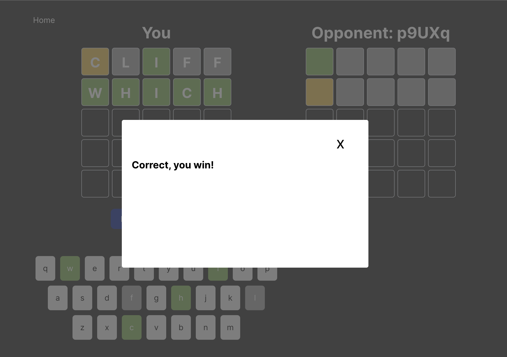

# Wordle

A game called Wordle, https://en.wikipedia.org/wiki/Wordle, which supports one or two play, with a server to store the game answer and data, which built from Typescript, React.js, SCSS, Node.js and Websocket.

## Installation and Local Running

-   For server side, under the root folder, navigate to the `server` folder by `cd server` and install the dependencies by `npm install`, then start the server with `npm run dev`. Or build the client-side with command `npm run build`.

-   For client side, under the root folder, navigate to the `client` folder by `cd client` and install the dependencies by `npm install`, then run it with `npm run start`. Or build the server-side with command `npm run build`.

-   After running both the server and client sides, we can start to play the game on `http://localhost:5173`.

## Game Design and How to Play

### Game Configuration:

For both one and two play, the Wordle game play can be configured from a variable `GAME_CONFIG` under `server/constants/gameConfig.ts`. There are two configurations to be sent to client for initialization of each game:

1. `maxRound`: number of max round of play;
2. `gamePickedWords`: a pool of answers (real word in 5 characters) that the server will randomly pick for each wordle game.

### Game Mode

#### One Play Mode

-   A player can play their own. The server will pick an answer for the player and validate it on server side. And the player will play it like a normal wordle. The client side will only get the answer from the server when a game is ended.

#### Two Play Mode

-   A player will be randomly assign to a room with other player. When a game start.

-   When a game start, i.e. both player join the same room, the server will pick an answer for this room, send game info to it and do the input validation like one play mode for each round. On the left side of the game board, it will display the guesses of the player their own. On the right side of the game board, it will display the opponent guesses score for each round sent from server. The winning conditions for a player will be:

    -   If there is a player guess the world correctly;
    -   their opponent run out of guesses;
    -   their opponent disconnected.

-   After the end of a game, the player can choose to play another game, which the server will randomly assign to another room for the player.

-   During the game, if the opponent disconnected from the server, the player inside the room can finish the game their own with server connection.

### Trade-off decisions:

1.  To reduce server structure complexity, one and two play game mode backend business logic are put within same file, which could be further refactored into two websockets services for two concern to increase maintainability at the current scale.

2.  To reduce game play complexity, room are assigned two play game by the server. Further improvement/a new feature could be letting user to join a room with their friend with a room key to improve user experience.

3.  To reduce game data collection complexity, the two play game mode traded-off parts of the user experience. We could implement more socket to collect and store more game data to the server, e.g. players input status and guesses, then:

    -   We could display it to the other player to let the player know the opponent is typing which could increase the interaction between two.
    -   When ending a game, we could display opponent guess history.

4.  To improve user experience, which trade-off the client and server structure complexity, the project includes both one and two play modes, which could allow a player to play their own if there is no other player online.

5.  To reduce UI complexity, a mobile version could be implement to improve user experience of the game play for mobile users.

### Bonus features

1. The app have two modes, a player can still play with their own when there is no other player online which can improve user experience.
2. For multi player mode, even if the opponent disconnected, the game can still continuous as the player left will, this can improve user game play experience.

## Screenshots

Home: 

 
One Play: 

 
Two Play: 

 

 

